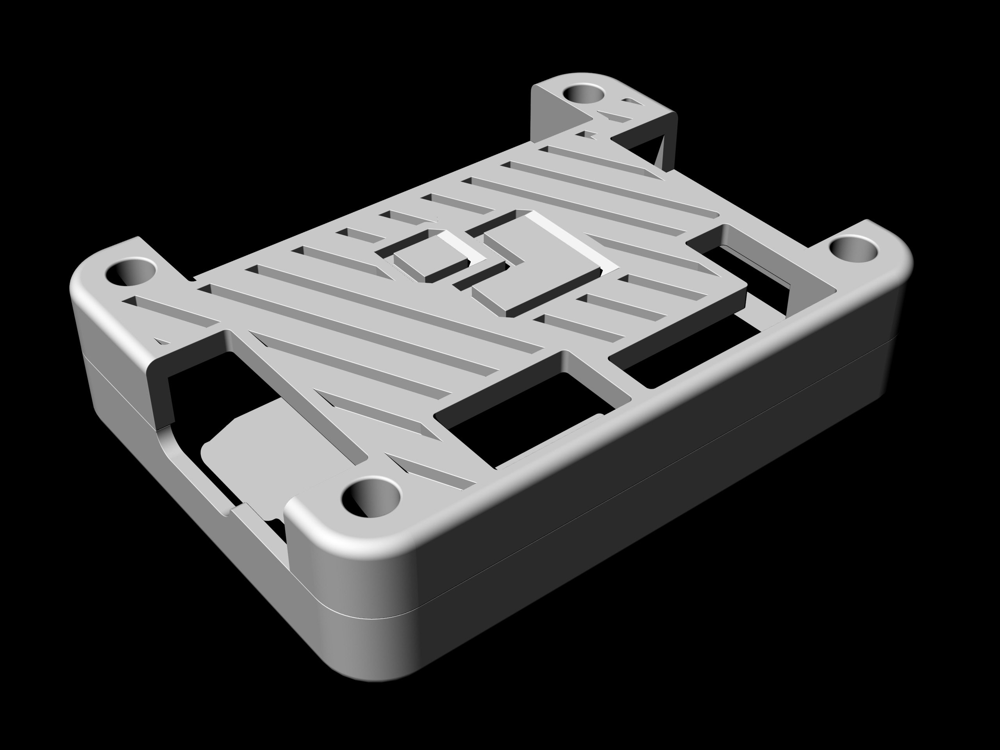

# icebreaker-altcase
An alternative case for the [iCEBreaker FPGA](https://www.crowdsupply.com/1bitsquared/icebreaker-fpga) by [@esden](https://github.com/esden) based on [@pimdegroot](https://github.com/pimdegroot)'s design.

# Changes
- Converted all mesh geometry to a set of polylines and a polysurface NURBS model.
- Added a gap in the top part on the case for the Creset header.
- Added additional 2mm rim height on the top part of the case.
- Added additional 1mm rim height on the bottom part of the case.
- Removed redundant geometry on the bottom of the top cover due to increased clearance.
- Added fillets in various corners to remove sharp edges.
- Added a 1BitSquared logo on the top part of the case.
- Added a diagonal hatch pattern on the top and bottom parts of the case.
- Added 0.3 mm clearance for the for M3 nuts on the bottom of the case.
- Added supports on the bottom of the case that need to be removed after printing. 

Red = Original Case, Green = Alternative Case

# License
As the original design it was based on, this case is shared as CC-BY-SA 4.0.
All printing tests were performed on a Creality Ender3, all NURBS modeling is done with Rhino 5.
